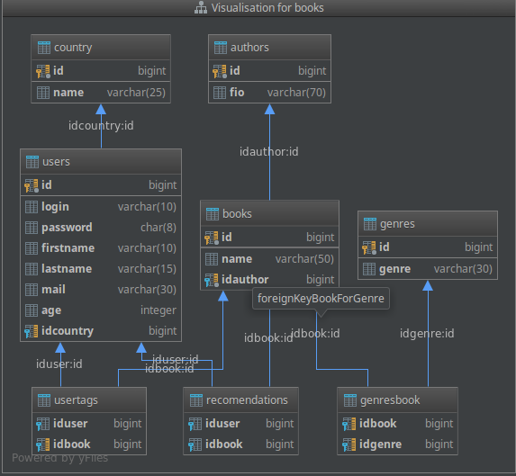

# Рекомендательный web-сервис книг
Наш небольшой проект для рекомендаций книг
============================    

### Используемые инструменты:

- [OS Linux Mint](https://linuxmint.com/) v 18 "Sarah" - Cinnamon (64-bit)
- [IntelliJ IDEA 2017](https://www.jetbrains.com/idea/) - основная среда разработки
- [PostgreSQL 9.5](https://www.postgresql.org/docs/9.5/static/release-9-5.html) - реляционная база данных
- [pgAdmin 4](https://www.pgadmin.org/) - инструмент для администрирования СУБД PostreSQL

### Технологии:
- Java 8
- Maven plugin
- Spring Boot
- Spring Boot Security
- Spring MVC + JSP
- Hibernate
- Apache Kafka
- Spring Tool Suite editor
- Bootstrap
- AJAX
- Apache Spark
- Spark SQL
- Spark Streaming

### Описание проекта:
Проект представляет собой сервис, который формирует для пользователя рекомендации книг на основе его интересов.
Рекомендации формируются по следующему принципу: если выбор пользователя какой-то частью совпадает с выбором других пользователей, то в качестве рекомендаций ему предлагаются те книги, которые были выбраны другими пользователями (кроме совпадающих книг).

Структура информации: информация хранится в БД Postgres. Структура БД:

### Структура проекта:
- [Web-приложение на Spring Boot Framework](./bookenizer) - личный кабинет пользователя
- [Стриминговое приложение на Spark Framework](./spark) - ядро для формирования рекомендаций
- [База данных PostgreSQL](./postgreSQL) - представлена дампом настроенной базы
- [Настройки проекта](./info.md) - необходимая информация для запуска проекта
